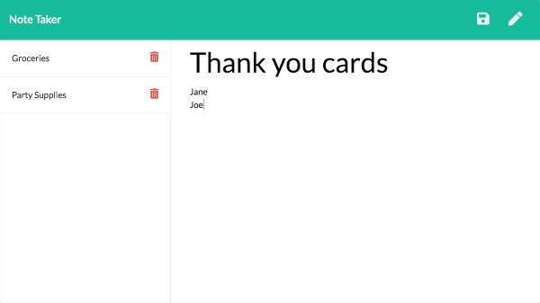
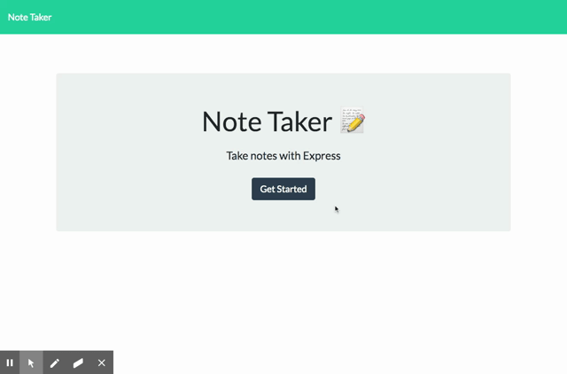

# Note-Taker
This application can write, save, and delete notes. It uses an express backend to save and retrieve data from a JSON file.

Initial starter files included a db.json and all files within the public folder, making up the frontend of this application. The backend was created thereafter to connect the two and make the app fully functional.

**Deployed through Heroku:** https://jungjungie-note-taker.herokuapp.com/

<div style="text-align:center"></div>


## Table of Contents
* [Installation](#Installation)
* [Usage](#Usage)
* [Demo](#Demo)
* [Contact](#Contact)


***
## Installation

Dependencies include:
- Express

If you are running this on your local server, run the following command to install necessary dependencies:
``` 
npm i 
``` 

***
## Usage

For local usage if you are not using the deployed link: 
- Run the following command to startup your local server:
```
node server
```
- In your web browser, type in the url: `http://localhost:8080/`


***
## Demo



***
## Contact
- **GitHub:**  [jungjungie](https://github.com/jungjungie)
- **Portfolio:**  [https://jungjungie.github.io/](https://jungjungie.github.io/)